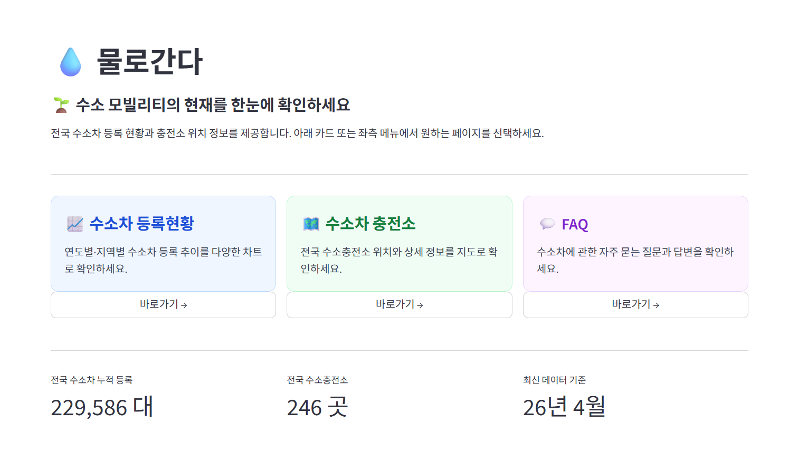
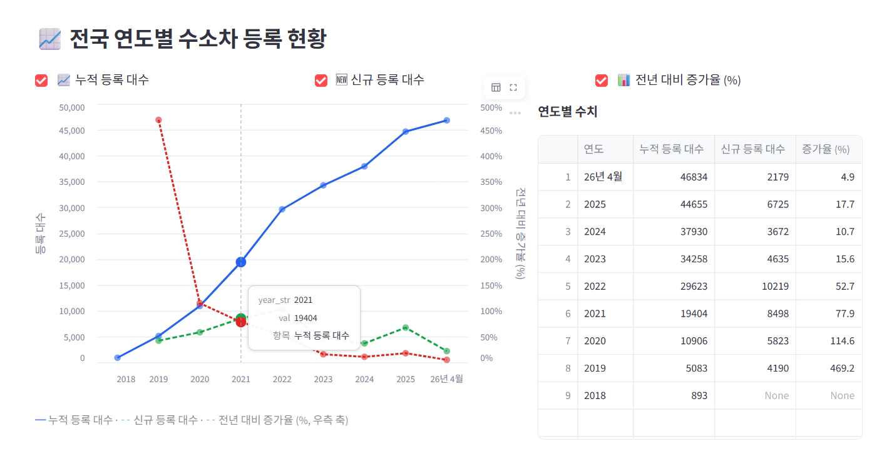
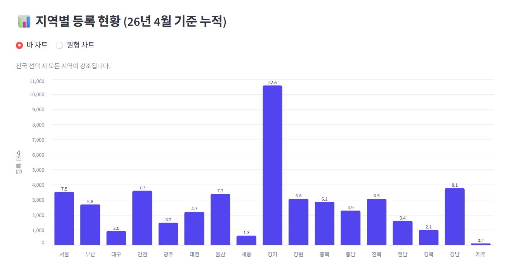
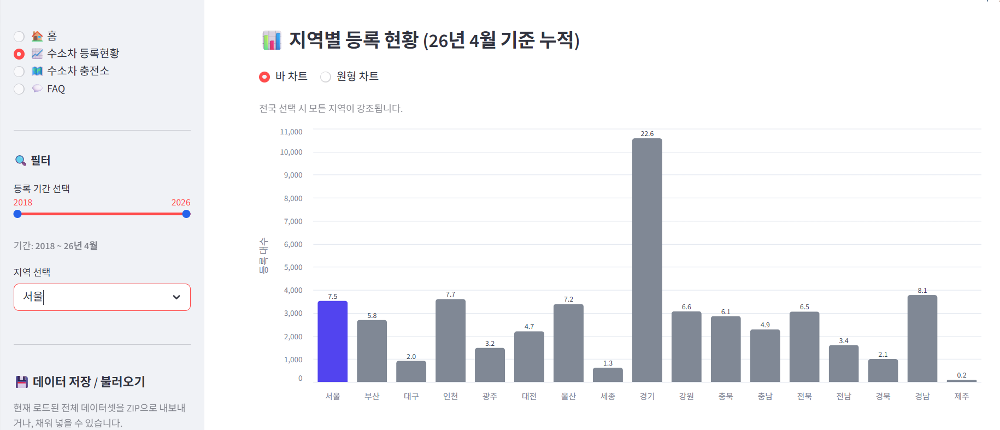
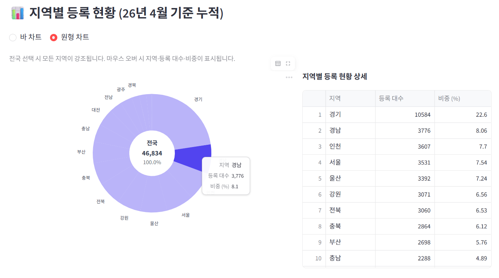
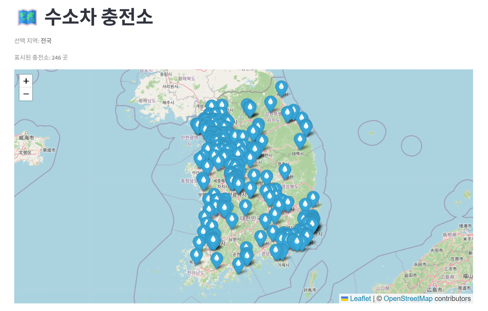
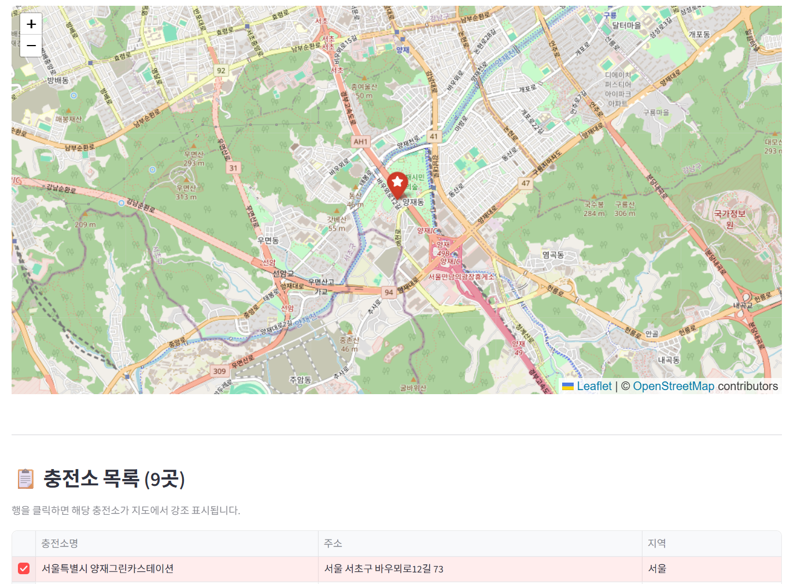
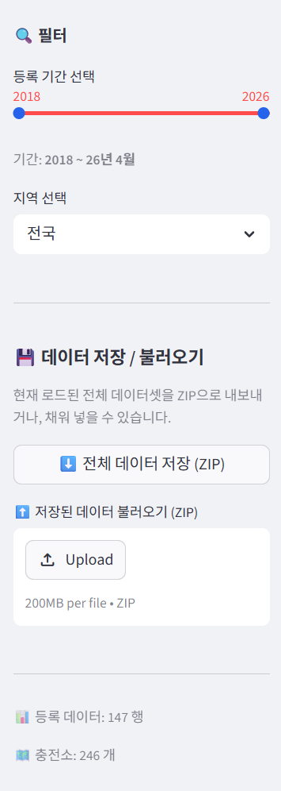
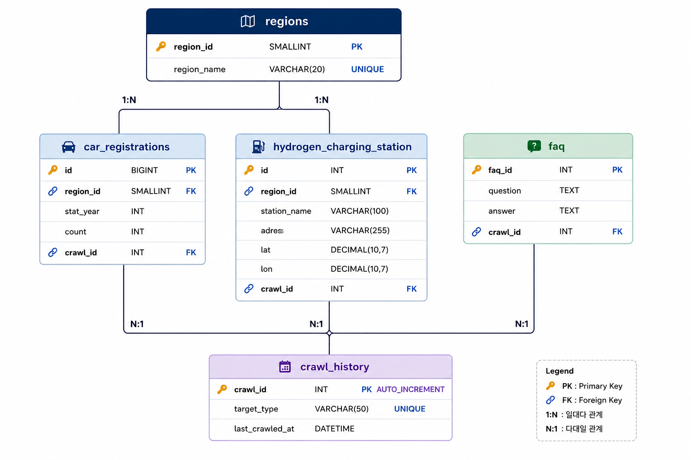

<div align="center">

# 🚗 물로간다
### 수소차 등록 현황 · 충전소 · FAQ 통합 대시보드


</div>

---

## 👥 팀 소개

<div align="center">

### 🏷️ Team **카데이터** | Project **물로간다**

| 역할 | 이름 | 담당 |
|:---:|:---:|:---|
| 👑 팀장 | 최연우 | Streamlit GUI 구현 | 발표 |
| 🗄️ 팀원 | 권소라 | MySQL DB 설계 및 데이터 저장 | PPT |
| 🕷️ 팀원 | 김지혜 | 크롤링 (bs4, Playwright) | 발표 |
| 🔗 팀원 | 박회종 | 파이썬 ↔ MySQL 연동 조회 시스템 | 시연 |

</div>


국토교통부 통계누리, 공공데이터 포털, EV 무공해차 통합누리집에서 수소차 등록 현황 · 수소충전소 · FAQ 데이터를 크롤링하여 MySQL에 저장하고, Streamlit으로 시각화하는 프로젝트입니다.



----------------------------------------------------------
## 1. 주요 기능

| 페이지 | 설명 |
|--------|------|
| 🏠 홈 | 전국 수소차 누적 등록 수·충전소 수·최신 기준 연도 요약 메트릭 |
| 📈 수소차 등록현황 | 연도별 누적·신규·증가율 선형 그래프, 지역별 바/원형 차트, 연도별 수치 테이블 |
| 🗺️ 수소차 충전소 | Folium 인터랙티브 지도, 충전소 목록 테이블 (행 클릭 → 지도 강조) |
| 💬 FAQ | ev.or.kr 자동 수집 FAQ, 키워드 검색 |

### 사이드바
- 등록 기간 슬라이더 / 지역 선택 드롭다운
- 전체 데이터셋 ZIP 저장 · 불러오기 (오프라인 백업)

----------------------------------------------------------
## 2. 스크린샷

### 🏠 홈


### 📈 수소차 등록현황 — 연도별 추이


### 📊 지역별 등록현황 — 바 차트 (전국)


### 📊 지역별 등록현황 — 바 차트 (서울 강조)


### 📊 지역별 등록현황 — 원형 차트


### 🗺️ 수소차 충전소 — 전국 지도


### 🗺️ 수소차 충전소 — 목록 선택 (양재그린카스테이션)


### 🔍 사이드바 — 필터 · 저장/불러오기


----------------------------------------------------------
## 3. 프로젝트 구조

```
SKN32-1st-3Team/
├─ app.py                        # Streamlit 대시보드 (4페이지)
├─ crawling/
│  ├─ crawler_molit.py           # 국토교통부 수소차 등록 현황 크롤러
│  ├─ crawler_station.py         # 공공데이터 포털 수소충전소 크롤러
│  ├─ crawler_faq_ev.py          # EV 무공해차 통합누리집 FAQ 크롤러
│  ├─ crawler_faq.py             # 현대자동차 FAQ 크롤러
│  └─ models.py                  # 데이터 클래스 (CarRegistrationItem, FaqItem, StationItem)
├─ data/
│  ├─ db.py                      # DB 엔진·스키마·CRUD 함수
│  ├─ repository.py              # Repository 패턴
│  └─ service.py                 # CrawlService / SchedulerService
├─ dbscript/
│  └─ dbscript_table.sql         # DB 스키마 SQL
├─ assets/                       # 스크린샷 및 ERD 이미지
├─ .streamlit/                   # Streamlit 설정
├─ requirements.txt
└─ README.md
```

----------------------------------------------------------
## 4. ERD



----------------------------------------------------------
## 5. 개발 환경

### 하드웨어 스펙

|   항목    |                   사양                    |
|-----------|-------------------------------------------|
| CPU       | Intel Core i5-1135G7 @ 2.40GHz (11th Gen) |
| RAM       | 16GB                                      |
| GPU       | Intel Iris Xe Graphics (공유 메모리 1GB)  |
| 저장장치  | SAMSUNG MZVLQ256HAJD (NVMe SSD, 256GB)    |
| OS        | Microsoft Windows 11 Pro (64비트)         |

### 소프트웨어 스펙

|         항목          |   버전    |
|-----------------------|-----------|
| Visual Studio Code    | 1.120.0   |
| Python                | 3.12.7    |
| Streamlit             | 1.57.0    |
| Playwright            | 1.59.0    |
| BeautifulSoup4        | 4.14.3    |
| lxml                  | 6.1.0     |
| SQLAlchemy            | 2.0.49    |
| PyMySQL               | 1.1.3     |
| Pandas                | 3.0.3     |
| Altair                | 5.x       |
| Folium                | 0.x       |
| requests              | 2.34.2    |
| openpyxl              | 3.1.5     |
| python-dotenv         | 1.2.2     |

----------------------------------------------------------
## 6. 환경 설정

### 가상환경 및 패키지 설치

```bash
cd SKN32-1st-3Team
python -m venv .venv
.venv\Scripts\activate

pip install -r requirements.txt
playwright install chromium
```

### `.env` 파일

프로젝트 루트에 `.env` 파일을 생성하고 DB 접속 정보를 입력합니다.

```env
DB_HOST=localhost
DB_PORT=3306
DB_USER=your_user
DB_PASSWORD=your_password
DB_NAME=crawler_db
```

### DB 스키마 생성

`dbscript/dbscript_table.sql`을 MySQL에서 한 번 실행합니다.

```bash
mysql -u your_user -p < dbscript/dbscript_table.sql
```

또는 MySQL Workbench에서 실행합니다.

```
1. Database → Connect to Database 로 서버에 접속
2. File → Open SQL Script → dbscript/dbscript_table.sql 선택
3. Ctrl + Shift + Enter (전체 스크립트 실행)
```

----------------------------------------------------------
## 7. 실행 방법

프로젝트 루트에서 실행합니다.

### 크롤러 (개별 실행)

```bash
# 국토교통부 수소차 등록 현황 크롤링 및 DB 저장
python -m crawling.crawler_molit

# 공공데이터 포털 수소충전소 크롤링 및 DB 저장
python -m crawling.crawler_station

# EV 무공해차 통합누리집 FAQ 크롤링 및 DB 저장
python -m crawling.crawler_faq
```

### 대시보드 (Streamlit)

```bash
python -m streamlit run app.py
```

> 앱 시작 시 현재 연도 데이터가 DB에 없으면 자동으로 크롤링을 수행합니다.  
> `data_backup/` 폴더에 ZIP 백업이 있으면 크롤링 없이 백업에서 바로 로드합니다.
